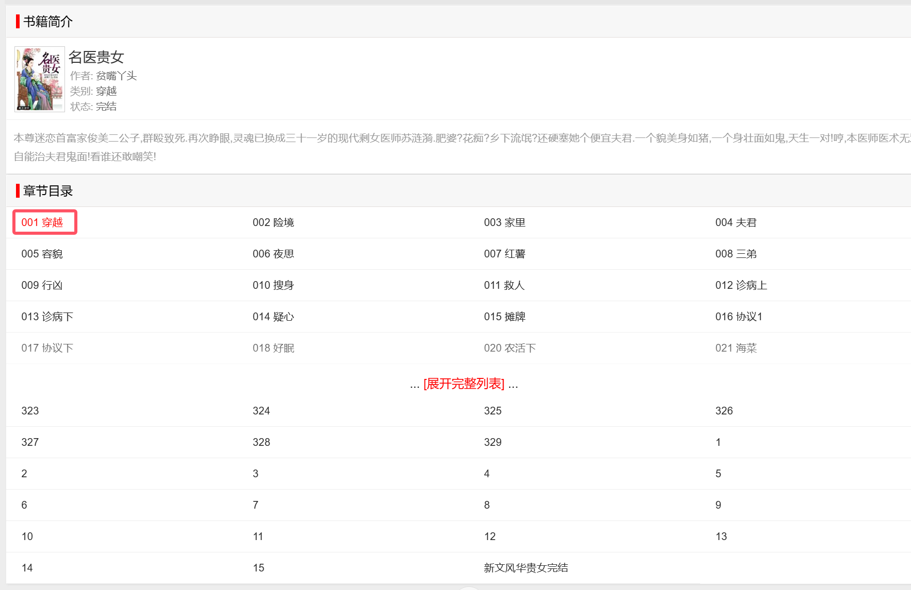
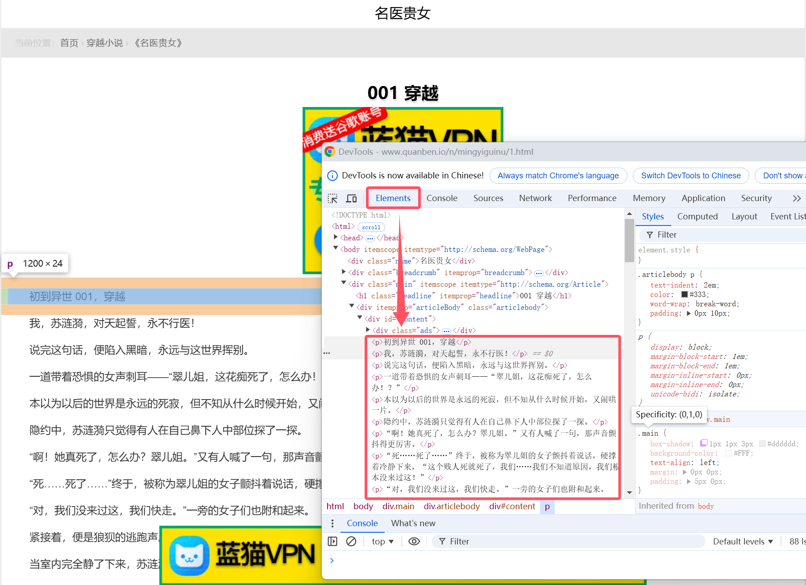
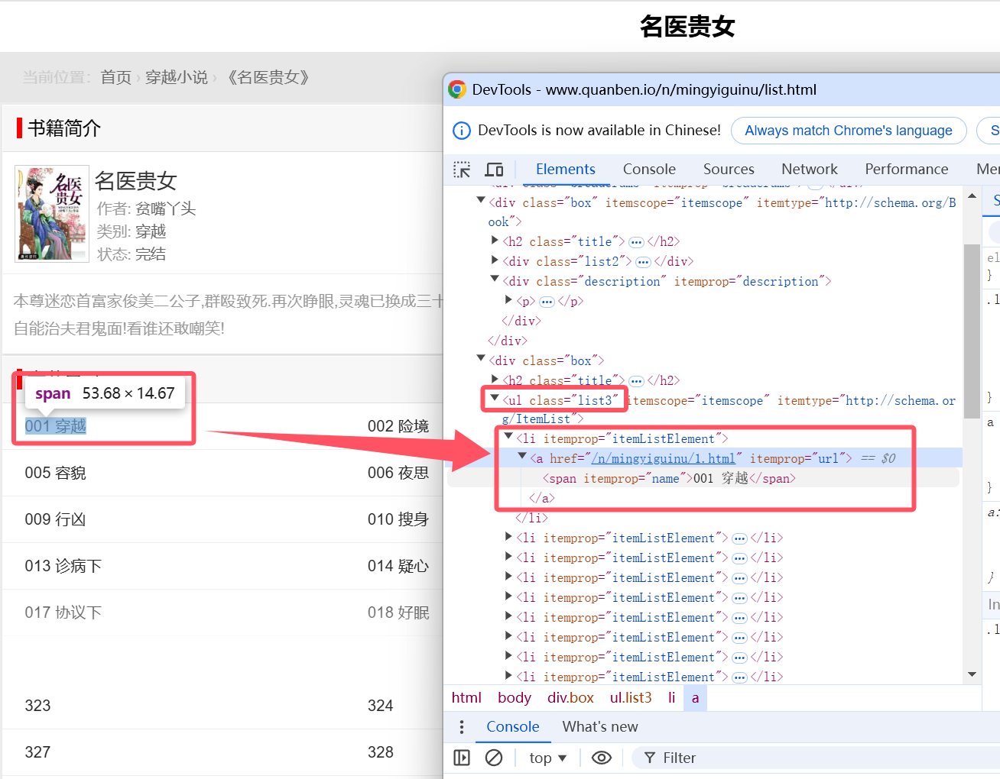
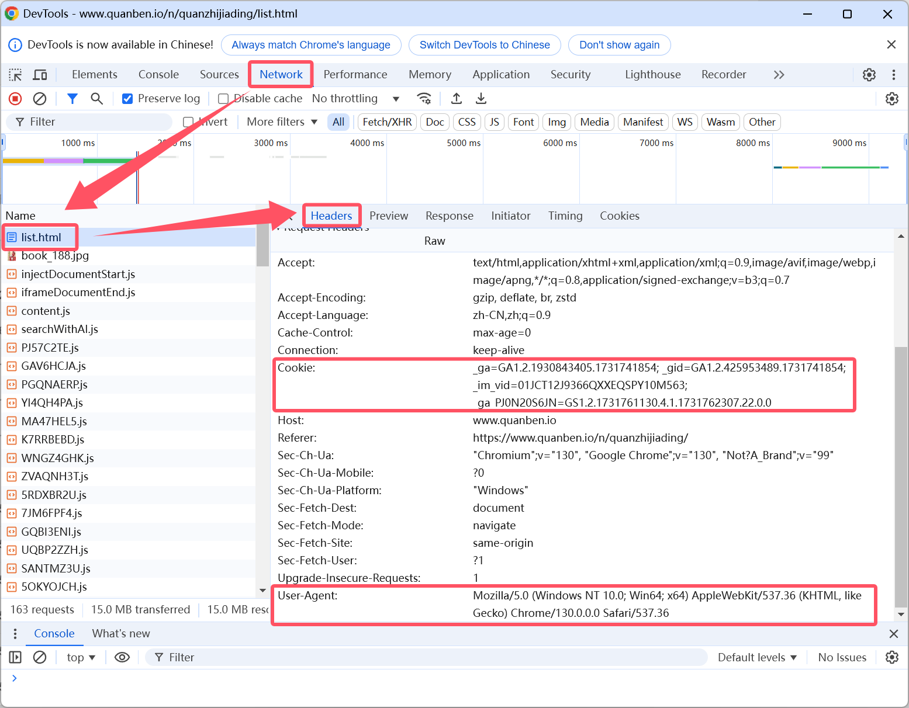
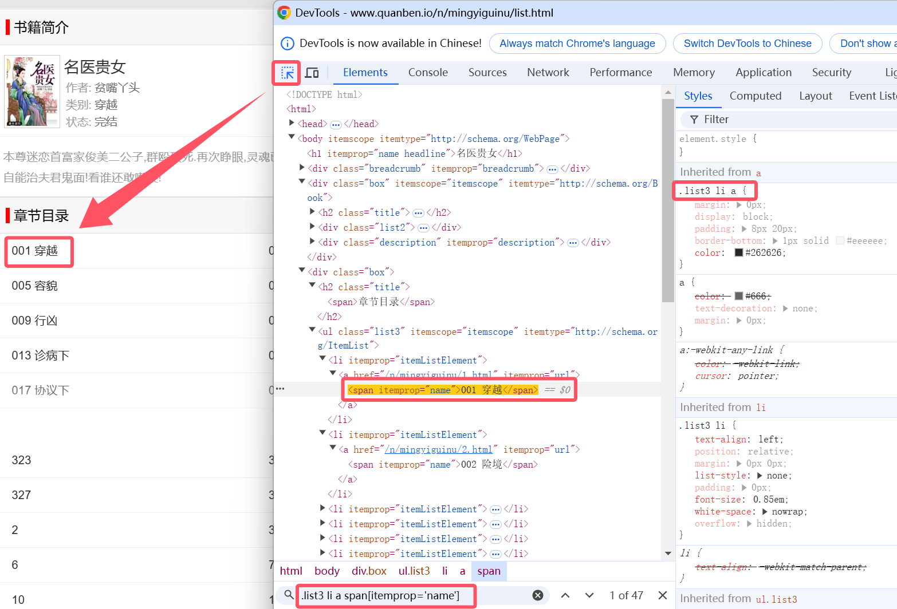
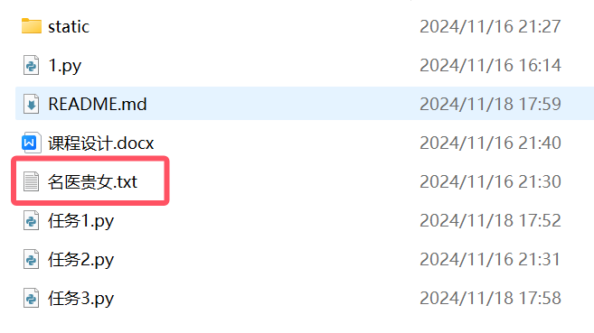
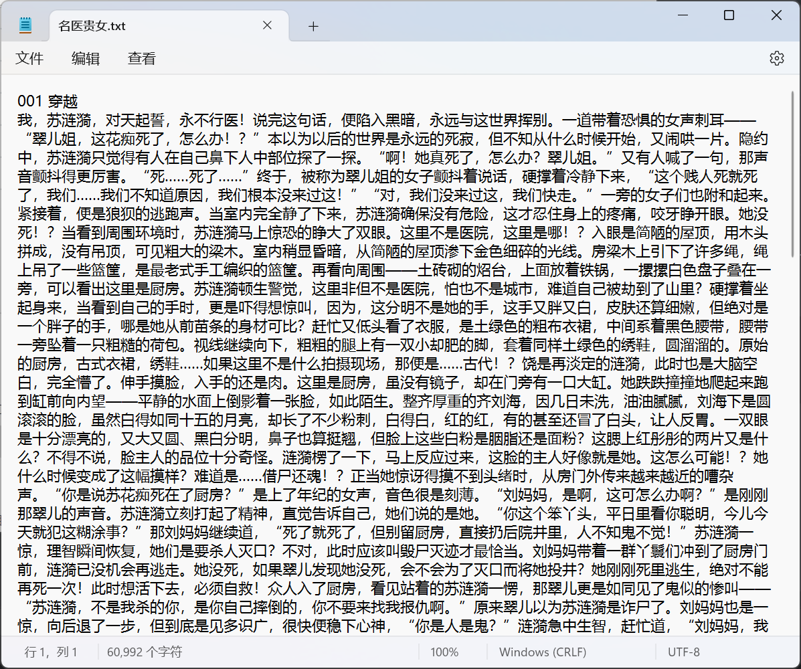

# 任务2：Python爬虫设计说明
## 环境配置
- Python 3.6+
- urllib.request、parsel、scrapy库
  - 用命令``pip install urllib.request parsel scrapy``进行安装
- 文本编辑器（如Sublime Text、VS Code、PyCharm等）

## 一、数据来源分析
### 1.明确需求
明确采集的网址及其数据内容
- 小说网址：https://www.quanben.io/n/mingyiguinu/list.html
- 数据：小说内容、小说名称、小说章节名

### 2.抓包分析方法
通过浏览器开发者工具分析对应的数据位置  
基本分析流程：
  1. 打开开发者工具
  2. 刷新页面
  3. 通过关键字搜索得到对应数据位置

### 3.分析小说内容具体位置
1. 内容链接地址：https://www.quanben.io/n/mingyiguinu/list.html
2. 点击第一章，利用开发者工具刷新页面获取文章内容位置



### 4.分析不同章节链接变化规律
1. 第一章链接：https://www.quanben.io/n/mingyiguinu/1.html
2. 第二章链接：https://www.quanben.io/n/mingyiguinu/2.html
3. 第三章链接：https://www.quanben.io/n/mingyiguinu/3.html  
- 通过对比链接发现：每一章节的链接地址只有最后面的数字不同（章节ID不同）
- 所以，如果想要获取整本书的章节内容，只需获取所有的章节ID即可。

### 5.分析章节ID从哪里获取
- 其实这个网址比较简单，章节ID就是最后的路径数字如1、2、3等。 但是这里还是研究一下如何更加精确地获取章节ID。（应对非上述网址的情况）
1. 因为ID都是来源于目录页面/列表页面的（包括图片、视频、音频、文件等数据格式）
2. 在抓包工具中直接选择跳转到每一章节的按钮，可以在Elements部分看到ID和名称的位置


## 二、代码实现步骤
1. 发送请求：模拟浏览器对URL地址发送请求
2. 获取数据：获取服务器返回的响应数据
3. 解析数据：提取我们想要的数据内容
4. 保存数据：保存数据到本地文件夹
### 1.获取章节ID小说名称
1. 找到数据请求头：


2. 发送请求：用request第三方模块进行请求的发送
   1. 常见的方法：GET、POST
   2. 请求参数（可在payload中查看）：
     - GET：查询参数、直接在连接中进行拼接（即？后面的部分）
     - POST：表单数据，参数是隐藏的
3. 获取数据：
   1. response.text：获取响应文本数据->字符串
   2. response.json()：获取json数据->字典/列表
   3. response.content：获取响应二进制数据
````
# 定义请求头
headers = {
    # Cookie 用户信息，常用于检测是否有登录账号
    'Cookie': "_ga=GA1.2.1930843405.1731741854; _gid=GA1.2.425953489.1731741854; _ga_PJ0N20S6JN=GS1.2.1731741854.1.1.1731741872.42.0.0",
    # User-Agent 用户代理，表示浏览器/设备的基本身份信息
    'User-Agent': "Mozilla/5.0 (Windows NT 10.0; Win64; x64) AppleWebKit/537.36 (KHTML, like Gecko) Chrome/130.0.0.0 Safari/537.36"
}
# url 地址
url = "https://www.quanben.io/n/mingyiguinu/list.html"
# 用requests库发送请求，注意请求参数与请求方法（GET获取信息/POST传递信息）
response = requests.get(url=url, headers=headers)
# 获取响应文本数据(html字符串数据)
html = response.text
````

4. 解析数据
   1. re：通过元字符对于字符串的数据进行解析
   2. xpath：节点提取，标签节点提取数据内容
   3. css选择器：根据标签属性提取数据内容
   4. json解析：字典取值/列表索引取值
   5. 直接处理数据：字符串高级方法：分割、替换
````
# 转换为可解析的对象
selector = parsel.Selector(html)
# 提取书名：.info-name利用class类名进行定位，h1定位h1标签，::text获取标签内文本内容
title = selector.css("h1[itemprop='name headline']::text").get()
print(title)
````

### 2.获取各个章节ID和名称
1. 利用开发者工具查看标题位置/标签；在右侧查看标签表达式并通过搜索功能进行验证


2. 利用Selector进行定位，获取章节ID和名称
````
# 提前章节ID和章节名
chapter_titles = selector.css(".list3 li a span[itemprop='name']::text").getall()
print(chapter_titles)
# 章节ID是href=的值，利用::attr获取href属性值
chapter_ids = selector.css(".list3 li a::attr(href)").getall()
print(chapter_ids)
````

### 3.获取小说内容
````
# for循环遍历获取列表中的元素
for chapter_title, link in zip(chapter_titles, chapter_ids):
    # print(chapter_title)
    link_url = "https://www.quanben.io" + link
    # print(link_url)
    # 发送请求，获取响应文本数据
    link_data = requests.get(url=link_url, headers=headers).text
    # 解析数据提取小说内容
    link_selector = parsel.Selector(link_data)
    content_list = link_selector.css(".articlebody p ::text").getall()
    # 将列表合并成字符串
    # content = "".join(content_list)
    content = "".join(content_list[1:]) # 去掉第一行(标题)
    print(content)
````

### 4.保存数据到本地

````
    ......
    print(content)
    with open(title + ".txt", mode="a", encoding="utf-8") as f:
        f.write(chapter_title)
        f.write("\n")
        f.write(novel_content)
````

### 5.运行结果

